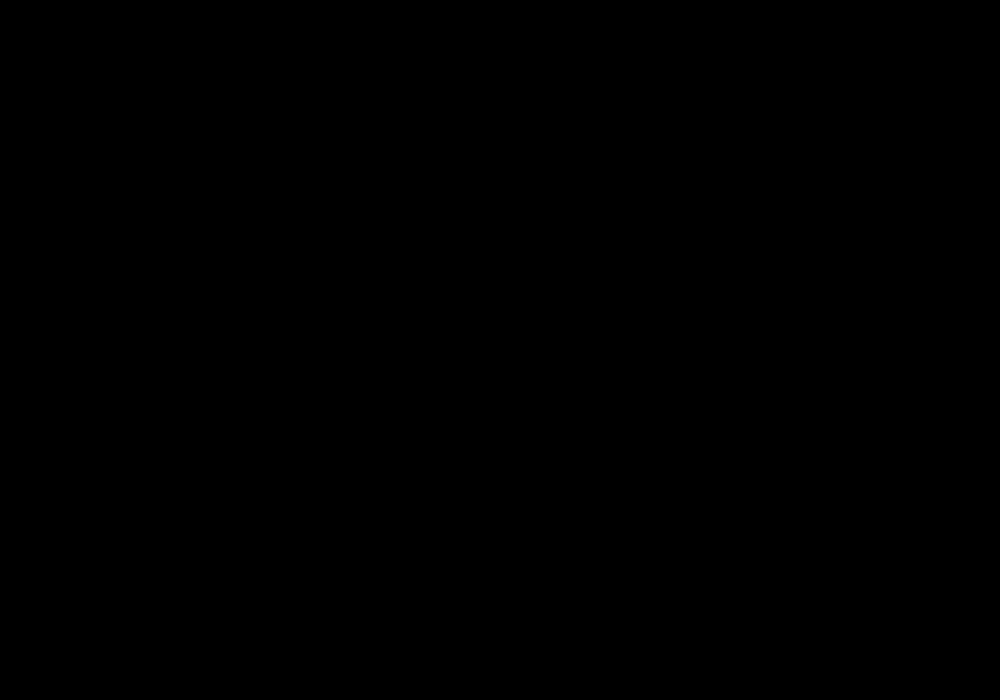

# N-Body Simulation

Simulation gravitationnelle de N particules en Python.

<div align="center">
  
</div>


## Lancer

```bash
pip install pygame numpy
python nbody.py
```

## Contrôles

| Touche | Action |
|--------|--------|
| ← → ↑ ↓ | Déplacer la vue |
| Z / S | Zoom avant / arrière |
| P | Screenshot |

## Physique

Chaque particule subit l'attraction gravitationnelle de toutes les autres :

$$a_i = \sum_{j \neq i} G \cdot m_j \cdot \frac{r_j - r_i}{|r_j - r_i|^3}$$

Intégration par la méthode d'Euler.
